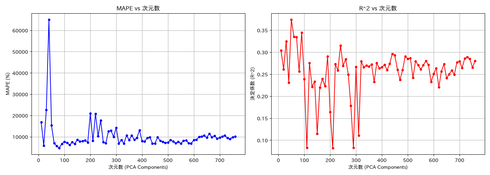
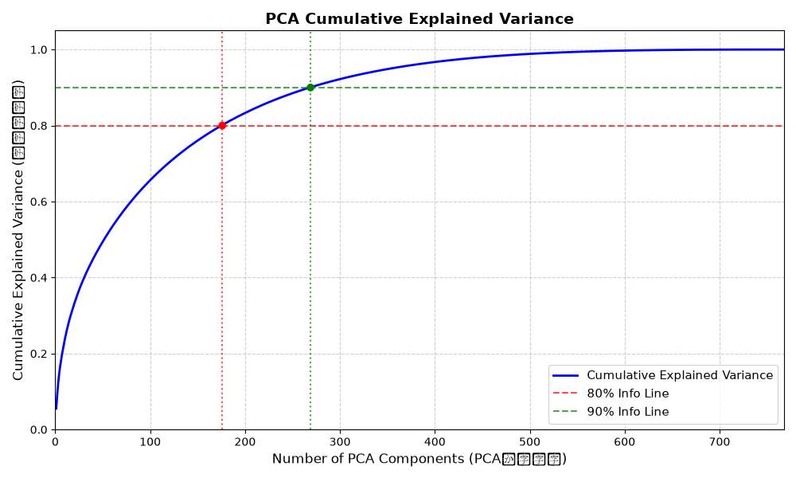
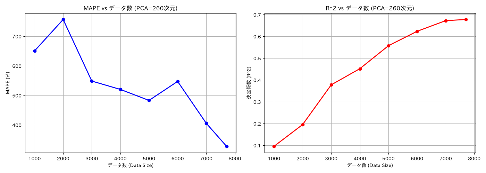
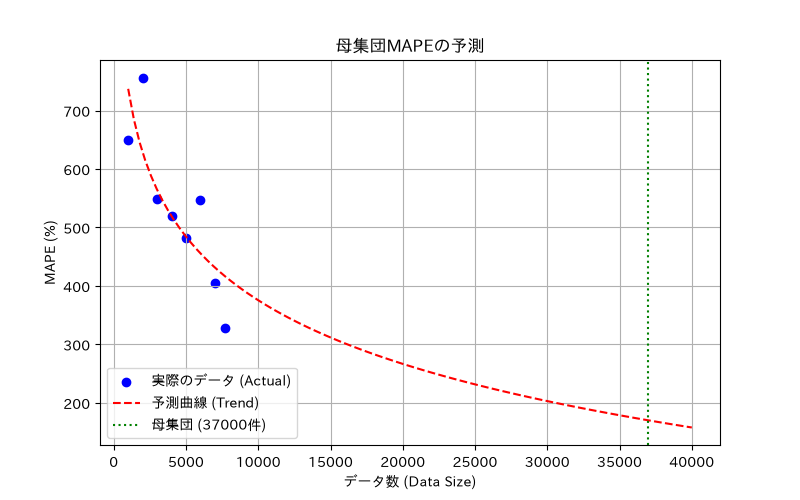

# サムネイルでの Vision-Transformer 利用

YouTubeなどのサムネイル画像（`english_titles.csv` の `thumbnail_link`）を Vision-Transformer (ViT) でベクトル化し、動画の `likes` 数（高評価数）を予測する実験の記録です。

---

## 0. テスト段階
本実験に向けた事前検証として、以下の動作確認を実施しました。
* 単一の URL から画像をダウンロードして保存 (`test.py`)
* データセットにあるサムネイル URL から画像を 5 枚ダウンロードして保存 (`test.py`)

---

## 1. スクレイピングと特徴量抽出
データセットからランダムに $n$ 件のデータを抽出し、サムネイル画像を ViT でベクトル化して `.pkl` ファイルとして保存しました (`scraping_thumbnail.py`)。
* **生成データセット:** `sample_1000_data.pkl`

---

## 2. 初期ランダムフォレストモデルの構築
取得した `.pkl` ファイルを使用し、高評価数を予測するベースラインモデルを構築しました (`random_forest_pkl.py`)。

| 評価指標 | 値 |
| :--- | :--- |
| **決定係数 ($R^2$)** | 0.2229 |
| **平均二乗誤差 (MSE)** | 37,301,503,880.61 |
| **MAPE** | 11,958.91% |

> [!NOTE]
> MAPE（平均絶対パーセント誤差）の値から分かる通り、初期モデルでは十分な精度が得られませんでした。

---

## 3. 次元削減の検討と実施

### 従来手法（試行錯誤）
最適な次元数を探るため、次元数を 10 刻みで変更しながらランダムフォレストの性能を比較しました (`performance_vs_dimensions.py`)。結果として 70 次元が良さそうに見えました。

### 中間報告の助言と改善
中間報告にて　「**次元数ごとの精度ではなく、累積寄与率で判断すべき**」という助言を受け、累積寄与率に基づく次元数選定に変更しました (`cumulative_contribution.py`)。

* **目標:** 情報を 80% および 90% 保持する次元数の特定
* **結果:** **約 260 次元**で 90% の累積寄与率に達することが判明

この結果を受け、`scraping_thumbnail.py` を用いて新たに 10,000 件のデータ取得を行い、主成分分析 (PCA) により 260 次元へ圧縮しました (`pca.py`)。
* **生成データセット:** `sample_10000_data.pkl` , `sample_10000_data_pca.pkl`

---

## 4. データ数拡大によるモデル性能の評価

データセット数を 1,000 ずつ段階的に増やしながらランダムフォレストモデルを学習させ、性能の変化（学習曲線）を検証しました。

### データ数別の評価結果一覧

| データ数 | y_test 最小値 | y_test 最大値 | y_test 平均 | y_test 分散 | MAPE | 決定係数 ($R^2$) |
| :---: | :---: | :---: | :---: | :---: | :---: | :---: |
| **1,000** | 120 | 119,382 | 23,107.86 | 602,551,339.58 | 650.26% | 0.0950 |
| **2,000** | 120 | 123,545 | 24,059.18 | 721,343,445.72 | 756.58% | 0.1948 |
| **3,000** | 101 | 123,187 | 23,578.59 | 678,614,991.17 | 548.17% | 0.3772 |
| **4,000** | 101 | 123,545 | 24,363.64 | 752,698,116.97 | 519.84% | 0.4513 |
| **5,000** | 102 | 121,715 | 22,411.51 | 624,997,950.73 | 482.72% | 0.5568 |
| **6,000** | 100 | 123,446 | 24,354.85 | 694,223,857.42 | 547.03% | 0.6229 |
| **7,000** | 100 | 123,446 | 24,393.10 | 695,606,200.33 | 405.39% | 0.6719 |
| **7,710** *(外れ値除去後)* | 100 | 123,446 | 25,797.93 | 754,283,961.16 | 327.30% | **0.6772** |

> [!NOTE]
> MAPE（平均絶対パーセント誤差）の値から分かる通り、300%台と今までで一番良い精度が得られました。

---

## 5. curve fittingを用いた将来の MAPE 予測

`predict_population_mape.py` を用いて、これまでのデータ数ごとの MAPE の推移を curve fitting で近似し、より多いデータ数（37,000 件）における予測誤差を推定しました。

### 実施内容
- これまでの実験結果（データ数ごとの MAPE）をもとに、曲線近似を行う
- 37,000 件程度での MAPE がどの程度になるかを外挿的に予測する
- 予測結果を可視化したグラフを `predict_population_mape.png` として保存する

### 結果

> [!NOTE]
> 予想MAPEは170.00%。依然として高いものの、一番良い記録となった。

